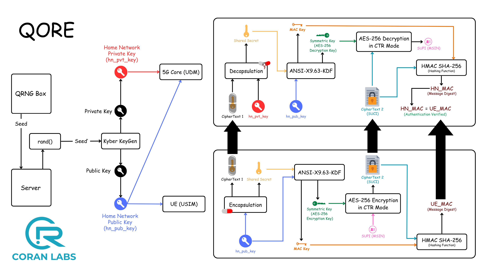
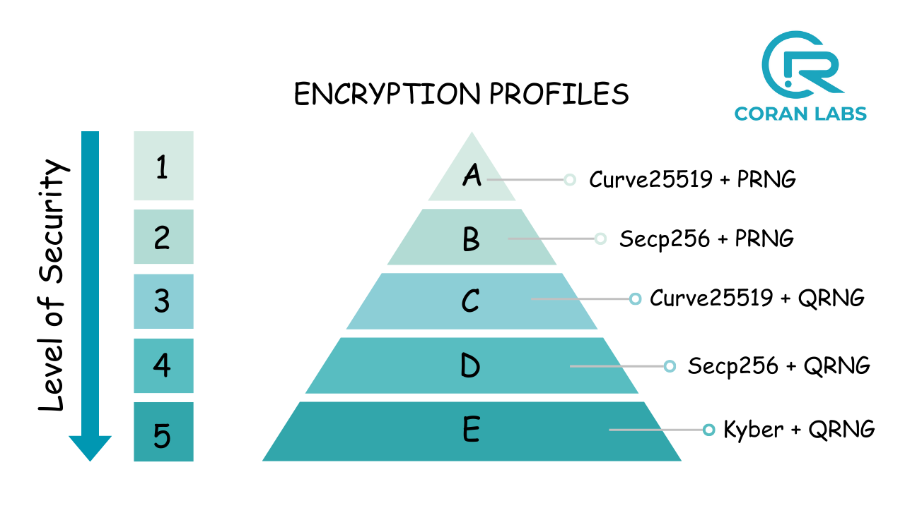

<table style="border-collapse: collapse; border: none;">
  <tr style="border-collapse: collapse; border: none;">
    <td style="border-collapse: collapse; border: none;">
      <a href="http://www.coranlabs.com/">
         
         </img>
      </a>
    </td>
    <td style="border-collapse: collapse; border: none; vertical-align: center;">
      <b><h1>QORE: QUANTUMIZED CORE SOLUTION</h1></b>
      <b><h2>Beyond 5G Core integrated with Post Quantum Cryptography and QRNG</h2></b>
    </td>
  </tr>
</table>

## TABLE OF CONTENTS
1. [Introduction](#introduction)
2. [Need for QORE](#need-for-qore)
   - [Problem Statement](#problem-statement)
   - [Solution](#solution)
3. [Migration to Post-Quantum Core using QORE](#migration-to-post-quantum-core-using-qore)
4. [Current Scenario of QORE](#current-scenario-of-qore)
   - [Subscriber's identity concealment: SUPI to SUCI conversion](#subscribers-identity-concealment-supi-to-suci-conversion)
5. [QORE Video](#qore-video)

## Introduction

**QORE** integrates **Post-Quantum Cryptography** and **Quantum Random Number Generator (QRNG)** into the Core network. Developed by [CoRan Labs](https://www.coranlabs.com/), QORE represents a significant advancement in ensuring robust security for core network against the impending threat of **Quantum Attacks**. By migrating classical cryptographic techniques used in the Core to Post-Quantum Cryptographic techniques, QORE offers enhanced security and reliability.

## Need for QORE?

#### Problem Statement:

The current Core, as defined by the 3GPP standard, currently relies on **classical cryptographic** techniques. However, these traditional encryption methods are increasingly vulnerable to quantum threats. **With the rise of quantum computers, classical cryptography can be easily broken.** Quantum computers have the capability to solve complex problems exponentially faster, allowing them to break traditional cryptographic algorithms. This renders current encryption methods insecure, exposing the classical Core to significant security risks.

#### Solution:
To secure the classical Core against these quantum threats, it is necessary to migrate to a **Post-Quantum Core**. This migration involves utilizing post-quantum cryptographic algorithms that are designed to be secure against the capabilities of quantum computers. Additionally, the generation of truly random numbers is crucial to ensure that cryptographic keys remain safe from quantum attacks.
QORE addresses these needs by integrating the following post-quantum techniques:
* `ML-KEM`: Module-Lattice-Based Key-Encapsulation Mechanism, ensures secure key exchange and protection against quantum attacks, utilizing lattice-based cryptography for strong security foundations.

* `ML-DSA`: Module-Lattice-Based Digital Signature Algorithm, a lattice-based digital signature scheme offering strong security guarantees against quantum computing threats.

* `QRNG seeds`: Utilizes Quantum Random Number Generators to produce truly random seeds, enhancing key security.

* `PQ-mTLS`: Post-Quantum Mutual Transport Layer Security to secure communication channels.

* `AES256`: Advanced Encryption Standard with 256-bit keys to ensure robust encryption.

* `PQ-IPSec`: Post-Quantum IPSec for securing Internet Protocol Security communications.

* `PQ-DTLS`: Post-Quantum Datagram Transport Layer Security for securing datagram communications.

## Migration to Post-Quantum Core using QORE

| **Feature**                        | **Classical Core**                                     | **Qore (Post-Quantum Core)**                           | **Status**   |
|---------------------------|-----------------------------------------------------|-----------------------------------------------|----------|
| **SUPI to SUCI**          | ECIES (Elliptic Curve Integrated Encryption Scheme) | ML-KEM  | ✅ Done     |
|                           |                                                     | Hybrid Post Quantum Mechanism                 |  ✅ Done        |  
| **Random Number**         | PRNG (Pseudo Random Number Generator)               | QRNG (Quantum Random Number Generator)        | ✅ Done     |
| **SBI Communication**     | mTLS                                                | PQ-mTLS                                        |   ✅ Done |
| **Digital Certificates**  | Classical cryptographic algorithm                   | ML-DSA                                     | ✅ Done     |
| **Symmetric Key**         | AES128                                              | AES256                                        | ✅ Done     |
| **N3 User Data**          | IPSec                                               | PQ-IPSec                                      |  🟡Ongoing     |
| **N3 User Data**          | DTLS                                                | PQ-DTLS                                       |  🟡Ongoing     |

## Current Scenario of QORE

### Subscriber's identity concealment: SUPI to SUCI conversion

Until now, user identities (IMSI) were vulnerable to IMSI catchers and the process of SUPI (Subscription Permanent Identifier) to SUCI (Subscription Concealed Identifier) conversion uses classical encryption methods that are susceptible to attacks from Quantum Computers.

QORE leverages Post Quantum Cryptography (Crystals-Kyber) integrated with Quantum Random Number Generator(QRNG). This quantum-proof algorithm ensures unparalleled security.

QORE supports multiple Encryption Profiles, each providing an increasing level of security, offering versatility and adaptability to various security requirements. The solution incorporates a QRNG for key generation, enhancing the security and randomness of encryption keys. It then uses Kyber for Key exchange mechansim. Additionally, AES-128 is replaced with AES-256, further strengthening encryption.

## QORE Video

Have a look at the introductory video of Qore

[Video Link](https://youtu.be/rZCRh8JKKN8?si=2fzzoELu9dX3lzPK)
