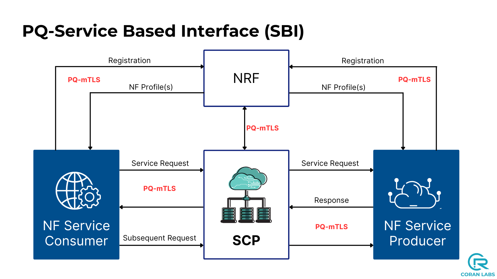
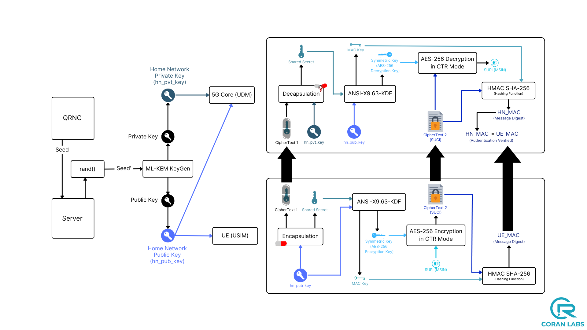
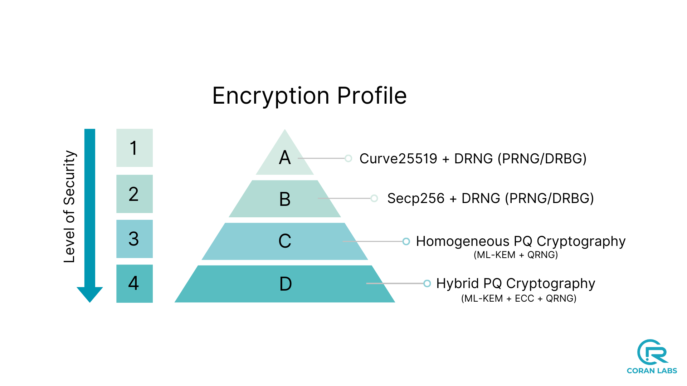
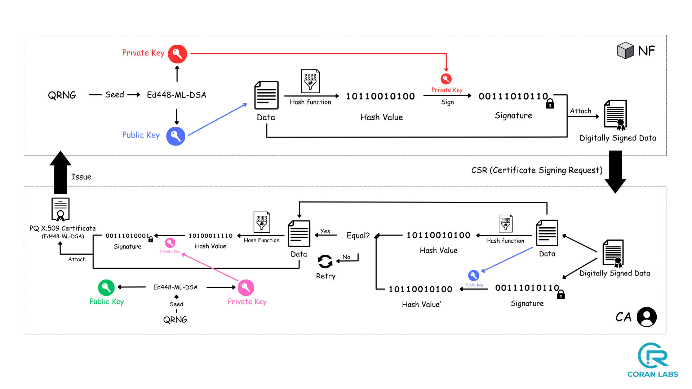
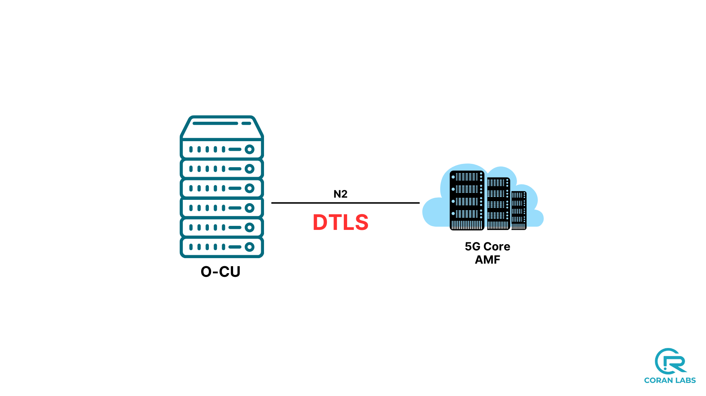
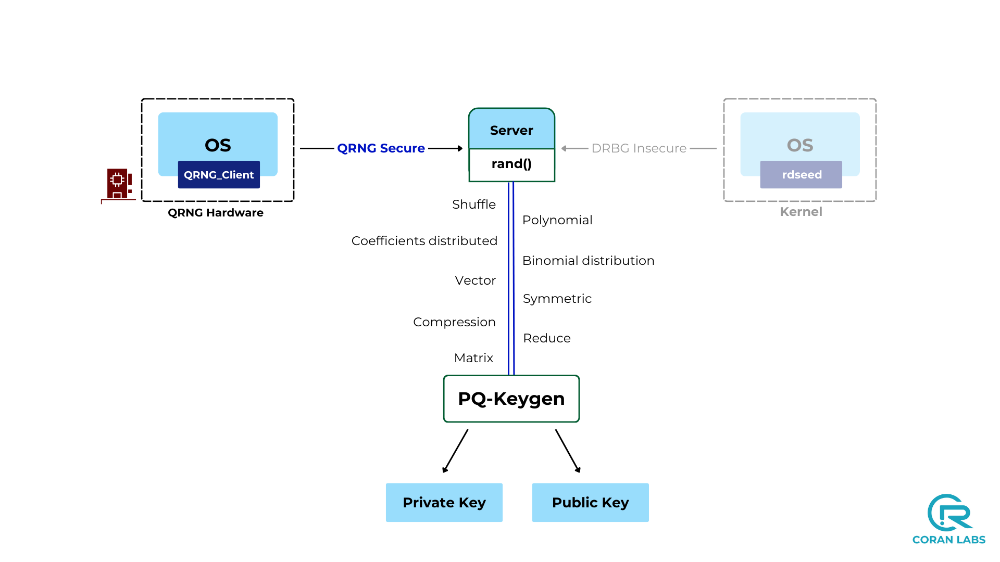
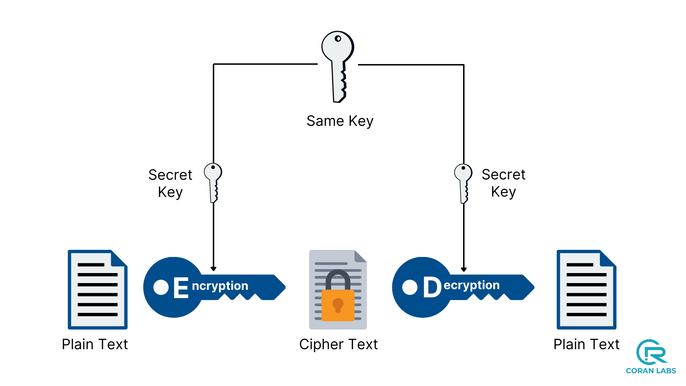

<table style="border-collapse: collapse; border: none;">
  <tr style="border-collapse: collapse; border: none;">
    <td style="border-collapse: collapse; border: none;">
      <a href="http://www.coranlabs.com/">
         
         </img>
      </a>
    </td>
    <td style="border-collapse: collapse; border: none; vertical-align: center;">
      <b><h1>QORE</h1></b>
      <b><h2>A Strategic Initiative to Quantumize the Global 5G Ecosystem</h2>
    </td>
  </tr>
</table>


---

## Overview

**QORE (QORE)** is a comprehensive research and development initiative by [coRAN Labs](https://www.coranlabs.com/) to systematically integrate **Post-Quantum Cryptography (PQC)** and **Quantum Random Number Generation (QRNG)** across the entire open source 5G/6G ecosystem. As quantum computing capabilities advance, traditional cryptographic methods face obsolescence. QORE addresses this existential threat by creating quantum-resistant implementations of all major open source cellular core networks.

### Mission Statement

To ensure the long-term security and viability of open source telecommunications infrastructure by providing production-ready, quantum-resistant implementations of every major 5G Core platform, enabling researchers, operators, and enterprises worldwide to deploy future-proof mobile networks.

**Note**: While QORE provides open source quantum-resistant implementations, coRAN Labs also offers consulting services to help enterprises assess, plan, and execute Post-Quantum Cryptography migration strategies for any 5G/6G Core platform. Contact: [contact@coranlabs.com](mailto:contact@coranlabs.com)

---

## Table of Contents

1. [Background and Motivation](#background-and-motivation)
2. [Project Scope](#project-scope)
3. [Quantumization Status](#quantumization-status)
4. [Technical Architecture](#technical-architecture)
5. [Post-Quantum Technologies](#post-quantum-technologies)
6. [Migration Path](#migration-path)
7. [Security Features](#security-features)
8. [Getting Started](#getting-started)
9. [Roadmap](#roadmap)
10. [Contributing](#contributing)
11. [Publications and Media](#publications-and-media)
12. [License](#license)
13. [Contact](#contact)

---

## Background and Motivation

### The Quantum Threat

Modern telecommunications infrastructure relies on cryptographic algorithms (RSA, ECDH, ECDSA) that will become vulnerable to quantum computers implementing Shor's algorithm. The timeline for cryptographically-relevant quantum computers (CRQCs) is uncertain, with estimates ranging from 5-15 years. However, several factors demand immediate action:

- **Harvest Now, Decrypt Later (HNDL)**: Adversaries are already capturing encrypted traffic for future decryption
- **Long Infrastructure Lifecycles**: 5G equipment deployed today will operate for 10-20 years
- **Regulatory Requirements**: Governments are beginning to mandate quantum-resistant cryptography
- **3GPP Evolution**: Standards bodies are actively developing PQC integration specifications

### Why Open Source Matters

The global telecommunications ecosystem includes multiple open source 5G Core implementations, each serving distinct use cases:

| **5G Core Platform** | **Focus Area** |
|--------------------|-----------------------|
| Free5GC | Academic research, education, algorithm development |
| OpenAirInterface (OAI) | Standards compliance, carrier R&D, pre-commercial testing |
| Aether SD-Core (ONF) | Private networks, enterprise 5G, edge computing |
| Open5GS | IoT platforms, MVNOs, small operators |
| Magma | Rural connectivity, community networks, emerging markets |


**QORE ensures quantum security across this entire ecosystem**, not just a single platform.

---

## Project Scope

### Vision: Universal Quantum Resistance

QORE aims to quantumize **every significant open source mobile core network implementation**, creating a comprehensive suite of quantum-resistant alternatives. This includes:

QORE systematically integrates Post-Quantum Cryptography across all layers of the 5G/6G ecosystem:

- **Core Network Functions**: Service-Based Architecture security, Network Function authentication, subscriber identity protection, certificate infrastructure
- **Control and User Planes**: Secure interfaces (N2, N3, N4) with quantum-resistant protocols
- **Edge and Cloud Infrastructure**: Multi-access Edge Computing security, network slicing isolation, cloud-native security
- **Standards Integration**: Collaboration with 3GPP, IETF, and industry partners for quantum-safe specifications

**Note**: RAN-level quantum security (gNodeB, O-RAN, RIC) is covered separately under the **q-RAN** initiative.

## Quantumization Status

### Completed Implementations

**Free5GC** and **Aether SD-Core** have been successfully quantumized with comprehensive Post-Quantum Cryptography integration:
- All Network Functions secured with PQ-mTLS 1.3
- ML-KEM-based SUPI encryption with hybrid mode support
- ML-DSA certificate infrastructure
- PQ-DTLS 1.3 for control plane (N2)
- PQ-IPSec for user plane (N3/N4)
- QRNG integration and AES-256 encryption
- Docker/Kubernetes deployment support

**Enterprise-Ready Features**:

**1. PQ-PKI Dashboard** (Management Console)
   - Web-based certificate lifecycle management interface
   - Real-time monitoring, audit logging, and compliance reporting
   - Role-based access control (RBAC) integration
   - Automated certificate renewal and revocation workflows

**2. Charmed Aether SD-Core** (Production Deployment)
   - Canonical Juju charm-based orchestration with PQ-mTLS
   - PQ-OAuth 2.0 for secure API authentication and authorization
   - Multi-cloud deployment (AWS, Azure, GCP, OpenStack, bare metal)
   - High availability, auto-scaling, and automated lifecycle management

**3. Q-RAN Integration** (End-to-End Quantum Security)
   - Validated with Q-RAN (Quantumized RAN) implementations
   - O-RAN compliant quantum-safe fronthaul/midhaul/backhaul interfaces
   - Support for commercial O-RAN radios and software-defined radios (SDRs)
   - Complete quantum-resistant network stack from Core to RAN to UE

> **For production deployments, PQ-PKI Dashboard access, Charmed Aether SD-Core, and commercial support:**  
> Contact: [contact@coranlabs.com](mailto:contact@coranlabs.com) | Website: [coranlabs.com](https://www.coranlabs.com)


**Repository locations**: `qore_free5gc/` and `qore_aether_sdcore/`

---

### In Progress

**OpenAirInterface (OAI)**

---

### Planned

**Open5GS** and **Magma Core**

---


## Technical Architecture

### Post-Quantum Technologies

QORE integrates NIST-standardized Post-Quantum Cryptographic algorithms:

#### Key Encapsulation Mechanisms
**ML-KEM (Module-Lattice-Based Key Encapsulation Mechanism)**
- **Standard**: FIPS 203
- **Security Levels**: ML-KEM-512, ML-KEM-768, ML-KEM-1024
- **Use Cases**: TLS/DTLS key exchange, SUPI encryption, IPsec IKEv2
- **Implementation**: Cloudflare Circl library, liboqs

#### Digital Signatures
**ML-DSA (Module-Lattice-Based Digital Signature Algorithm)**
- **Standard**: FIPS 204
- **Security Levels**: ML-DSA-44, ML-DSA-65, ML-DSA-87
- **Use Cases**: Certificate signatures, NF authentication, message signing
- **Implementation**: Circl, liboqs

#### Hash-Based Signatures (Future)
**SLH-DSA (Stateless Hash-Based Digital Signature Algorithm)**
- **Standard**: FIPS 205
- **Planned Integration**: Q3 2025 for certificate authority root keys

### Cryptographic Protocols

#### PQ-mTLS 1.3 (Post-Quantum Mutual TLS)
Quantum-resistant adaptation of TLS 1.3 for Service-Based Interface (SBI) protection:
- Replaces ECDHE with ML-KEM for key exchange
- Uses ML-DSA for certificate signatures
- Maintains TLS 1.3 handshake efficiency
- Backward compatibility with hybrid mode (classical + PQ)

#### PQ-DTLS 1.3 (Post-Quantum Datagram TLS)
Secures connection-oriented protocols over unreliable transports:
- Used for N2 interface (NGAP over SCTP between gNB and AMF)
- Protects control plane signaling
- Low latency suitable for radio interface timing requirements

#### PQ-IPsec (Post-Quantum IPsec)
Quantum-safe user plane encryption:
- IKEv2 with ML-KEM for key establishment
- Protects N3 (gNB-UPF), N4 (SMF-UPF), N9 (UPF-UPF) interfaces
- ESP encryption with AES-256-GCM
- Hardware acceleration support for line-rate performance

### Quantum Random Number Generation

**QRNG Integration**:
- True random number generation using quantum entropy sources
- Eliminates pseudo-random number generator (PRNG) vulnerabilities
- Used for cryptographic key generation, nonces, IVs
- API integration with multiple QRNG providers (ID Quantique, Quintessence Labs)

---

## Migration Path

### Classical to Post-Quantum Transition

| **Feature** | **Classical Core** | **QORE (Post-Quantum Core)** | **Status** |
|-------------|-------------------|------------------------------|------------|
| **SBI Communication** | mTLS | PQ-mTLS 1.3 | Completed |
| **SUPI to SUCI** | ECIES | PQ-IES (ML-KEM) | Completed |
|  |  | PQ-IES (Hybrid ML-KEM) | Completed |
| **Digital Certificates** | Classical Certificates | ML-DSA | Completed |
| **N2 Control Plane** | DTLS | PQ-DTLS 1.3 | Completed |
| **N2 User Data** | IPSec | PQ-IPSec (IKEv2 with PQ) | Completed |
| **N3 User Data** | IPSec | PQ-IPSec (IKEv2 with PQ) | Completed |
| **N4 User Data** | IPSec | PQ-IPSec (IKEv2 with PQ) | Completed |
| **PKI** | Classical PKI/Private CA | PQ-PKI/Private PQ-CA | Completed |
| **Symmetric Key** | AES-128 | AES-256* | Completed |
| **Random Number** | PRNG | QRNG* | Completed |


---

## Security Features

### Service-Based Interface (SBI) Protection

The Service-Based Architecture in 5G Core relies on HTTP/2 with TLS for inter-NF communication. QORE enhances this with PQ-mTLS:



**Key Features**:
- Mutual authentication using ML-DSA certificates
- Perfect Forward Secrecy (PFS) with ML-KEM key exchange
- Session resumption with post-quantum session tickets
- HTTP/2 multiplexing preserved

---

### Subscriber Identity Protection (SUPI Concealment)

SUPI (Subscription Permanent Identifier) encryption prevents IMSI catching attacks. QORE implements quantum-resistant SUPI encryption:



**Implementation Details**:
- **Profile A**: ML-KEM-768 key encapsulation
- **Profile B**: ML-KEM-1024 for high-security deployments
- **Hybrid Mode**: Combined classical ECIES + ML-KEM
- Home Network decryption with QRNG-derived keys



---

### Certificate Infrastructure

Post-Quantum Public Key Infrastructure (PQ-PKI) with ML-DSA signatures:



**Components**:
- Root CA with ML-DSA-87 signatures
- Intermediate CAs for organizational hierarchy
- End-entity certificates for each NF
- Certificate Revocation Lists (CRL) with quantum-safe signatures
- OCSP responder with PQ authentication

- Web-based PQ-PKI Dashboard for enterprise deployments
- Certificate lifecycle management (issuance, renewal, revocation)
- Real-time monitoring and audit logging
- Role-based access control (RBAC)
- Integration with existing enterprise identity systems

---

### Backhaul Security (N2 Interface)

The N2 interface carries NGAP signaling between gNodeB and AMF. QORE secures this with PQ-DTLS 1.3:



---

### Quantum Random Number Generation

True randomness is critical for cryptographic security. QORE integrates QRNG for unpredictable key material:



---

### Enhanced Symmetric Encryption

While symmetric cryptography has higher quantum resistance, QORE upgrades to AES-256 for defense-in-depth:



---


## Getting Started

### Prerequisites

- **Operating System**: Ubuntu 20.04/22.04 LTS or RHEL 8/9
- **Container Runtime**: Docker 20.10+ and Docker Compose, or Podman 4.0+
- **Orchestration** (for Aether): Kubernetes 1.24+ with Helm 3.8+
- **Hardware**: x86_64 architecture, 8+ CPU cores, 16GB+ RAM
- **Networking**: Multiple network interfaces or VLAN support for user/control plane separation

### Quick Start: Free5GC Variant

```bash
# Clone the repository
git clone https://github.com/coRAN-LABS/qore-rel1.git
cd qore-rel1/qore_free5gc

# Build containers with PQ support
docker-compose build

# Deploy the core network
docker-compose up -d

# Verify NF status
docker-compose ps

# View logs
docker-compose logs -f amf
```

### Quick Start: Aether SD-Core Variant


> **Note**: For production deployments with Charmed Aether SD-Core, PQ-PKI Dashboard, and commercial support, see our [enterprise offerings](mailto:contact@coranlabs.com).

```bash
cd qore-rel1/qore_aether_sdcore

# Install via Helm
helm install sd-core-pq ./helm-charts/sd-core-pq

# Verify deployment
kubectl get pods -n aether
```

**Detailed Documentation**: See individual project directories for deployment guides.

---

## Roadmap

### 2024-25 (Completed)
- Successfully quantumized Free5GC and Aether SD-Core platforms
- Integrated ML-KEM, ML-DSA, and QRNG across all network functions
- Established coRAN LABS Public License framework
- Launched community engagement with LFN, Anuket, and ONAP

### 2025 Focus Areas
- Complete quantumization of additional open source 5G Core platforms (OAI, Open5GS, Magma)
- 3GPP Release 17+ compliance and standards alignment
- Performance optimization and production deployment support
- Multi-vendor interoperability testing and certification
- Enhanced QRNG integration and edge deployment optimization

### 2026 and Beyond
- Advanced quantum-safe features (network slicing, MEC security)
- Hardware acceleration partnerships for production-scale deployments
- Expanded ecosystem support and operator production pilots
- AI/ML integration for quantum threat detection and response
- Contribution to 3GPP Release 18+ quantum security specifications

---

## Contributing

QORE is an open research initiative. We welcome contributions from academia, industry, and the open source community.

### How to Contribute

1. **Code Contributions**: Implement PQC for additional NFs or platforms
2. **Testing**: Interoperability testing, performance benchmarking, security audits
3. **Documentation**: Deployment guides, API documentation, tutorials
4. **Research**: Algorithm optimization, protocol design, threat modeling

### Contribution Process

```bash
# Fork the repository
git clone https://github.com/YOUR_USERNAME/qore-rel1.git

# Create a feature branch
git checkout -b feature/pqc-implementation

# Make your changes and commit
git commit -m "Add ML-KEM support to component"

# Push and create a Pull Request
git push origin feature/pqc-implementation
```

**Contributor License Agreement**: By submitting a contribution, you agree to license your work under the coRAN LABS Public License v1.0.

---

## Publications and Media

### Academic Papers
1. "Post-Quantum mTLS for 5G Service-Based Architecture" - IEEE INFOCOM 2024 Workshop
2. "Quantum-Resistant SUPI Encryption in 5G Standalone Networks" - ACM CCS 2024

### Whitepapers and Technical Documentation
- [coRAN Labs Whitepapers Repository](https://github.com/coranlabs/WhitePapers) - Comprehensive technical documentation, architecture guides, and research papers

### Videos and Demonstrations
1. [QORE: Implementing PQ-mTLS 1.3 in 5G Core](https://youtu.be/W5AgYsJQySw)
2. [5G QORE: Post-Quantum Cryptography in Action](https://youtu.be/rZCRh8JKKN8)
3. [QORE: Quantumized 5G Core Deployment](https://youtu.be/w1ac3SMiGmM)
4. [QORE: Post-Quantum Security for 5G Networks](https://www.youtube.com/watch?v=yiH2O24eUWk)

### Industry and Standards Body References
1. **Anuket TSC Discussion**: [Post-Quantum Cryptography in Cloud Native Telecom](https://lists.anuket.io/g/anuket-tsc/topic/111535604)
2. **ONAP TSC**: [Quantum Security Integration Proposal](https://lists.onap.org/g/onap-tsc/message/9611)
3. **LFN CNTI**: Input from ETSI on Quantum Security & Encryption - [PoC Slides](https://share.google/3zyXvHcW4i5jXn9zS)
4. **QORE Project Presentation**: [Slides and Technical Overview](https://share.google/IQKQa9fy4813DsL1M)

---

## License
**QORE** is licensed under the **coRAN LABS Public License Version 1.0**.

### License Summary
- **Research and Academic Use**: Free, no restrictions
- **Commercial Use**: Requires FRAND (Fair, Reasonable, Non-Discriminatory) licensing
- **Patent Grant**: Royalty-free for research, negotiable for commercial deployment
- **Third-Party Components**: Original licenses apply (see [NOTICE](NOTICE) file)

**Full License**: [LICENSE](LICENSE)  
**Third-Party Notices**: [NOTICE](NOTICE)

### Commercial Licensing
For commercial deployment, product integration, or custom development:
- **Email**: contact@coranlabs.com
- **Partnership Inquiries**: contact@coranlabs.com

---

## Contact

### coRAN Labs
- **Website**: [www.coranlabs.com](https://www.coranlabs.com/)
- **Email**: contact@coranlabs.com
- **GitHub**: [github.com/coRAN-LABS](https://github.com/coRAN-LABS)

### Technical Support
- **Issue Tracker**: [GitHub Issues](https://github.com/coRAN-LABS/qore-rel1/issues)
- **Discussion Forum**: [GitHub Discussions](https://github.com/coRAN-LABS/qore-rel1/discussions)

---

<p align="center">
  <strong>Securing the Future of Telecommunications</strong><br>
  <em>QORE: Making Every 5G Core Quantum-Resistant</em>
</p>

<p align="center">
  Copyright © 2024 coRAN Labs and Contributors<br>
  Licensed under coRAN LABS Public License v1.0
</p>
