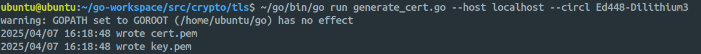

# Generate PQ-Certificates Using Go

This is a custom Go library that includes support for advanced TLS features via [Cloudflare's CIRCL](https://github.com/cloudflare/circl). The patched TLS stack includes support for:

- [Encrypted ClientHello (ECH)](https://blog.cloudflare.com/encrypted-client-hello/)
- [Post-Quantum Key Agreement](https://blog.cloudflare.com/post-quantum-for-all/)
- [Delegated Credentials](https://blog.cloudflare.com/keyless-delegation/)
- Post-Quantum Certificates
- Configuration of keyshares in `ClientHello` via `tls.Config.ClientCurveGuess`

## 1. Install Go 1.22.5 (Bootstrap Compiler)

Go 1.22.5 is required to act as a bootstrap compiler for building the modified Go library.

```bash
wget https://go.dev/dl/go1.22.5.linux-amd64.tar.gz
sudo tar -xzvf go1.22.5.linux-amd64.tar.gz --directory=/usr/local/
echo 'export PATH=$PATH:/usr/local/go/bin' >> ~/.bashrc
source ~/.bashrc
```

## 2. Clone and Build Custom Go with CIRCL Integration

Clone the modified Go source and build it:

```bash
git clone https://github.com/lakshya-chopra/go.git
cd go/src/
./make.bash
```

Update your environment to use the custom Go binary:

```bash
echo 'export PATH=$PATH:/home/ubuntu/go/bin' >> ~/.bashrc
source ~/.bashrc
```

> [!NOTE]
> Adjust the path if you cloned the custom Go source to a different location.

## 3. Verify the Setup

Navigate to the TLS package inside the Go source directory:

```bash
cd ~/go/src/crypto/tls/
```

Check if the certificate generator script runs:

```bash
~/go/bin/go run generate_cert.go --help
```

## 4. Troubleshooting: Version Mismatch Error

If you see an error like:

```text
go: ../../go.mod requires go >= 1.23 (running go 1.22.5; GOTOOLCHAIN=local)
```

Update the `go.mod` file to match your custom Go version:

```go
// File: go/src/go.mod
go 1.22
```

> [!IMPORTANT]
> This setup ensures compatibility when working directly within the modified Go source tree. The same repository is used by QORE without requiring any further changes. Modifying the go.mod file is only necessary for generating certificates and private keys using the custom Go build. The certificates and keys generated through this process remain valid for QORE, regardless of the go.mod version adjustment.

## 5. Generate Certificates and Private Keys

Once everything is set up, you can use the `generate_cert.go` script to create PQ/TLS certs:

```bash
~/go/bin/go run generate_cert.go --host localhost --circl Ed448-Dilithium3
```

This will create a PQ-certificate and its private key for the specified host and CIRCL algorithm.

